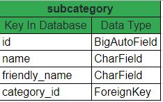
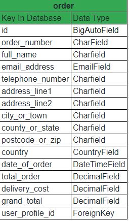

# Green Gardens

[View GreenGardens website here](https://greengardens1.herokuapp.com/)


## The goal of this e-commerce website is to sell garden products to users and provide a blog displaying users with tips and tricks uploaded by the owner. The user will have the ability to login/create an account profile and save their personal information for future purchases and faster checkout.

### User Experience (UX)

#### The user goals will be to:
* Easily navigate through the website.
* Access the website using multiple devices.
* Register and create an account profile to store personal information for future login and faster checkout.
* Buy gardening products.
* Update shopping basket.
* Delete products from shopping basket.
* Checkout and receive confirmation that the order has been placed
* View a blog tips and tricks.


### User Stories

#### As a user, I want - 
* the navigation bar clearly visible, displaying products by category and sub category so I can easily navigate the website.
* the website responsive across devices so I can swap and change devices.
* the page laid out neatly so that I can find information effortlessly with a search bar allowing me to search for product items by name or product detail.
* to create an account profile that will store my personal information for speedy transactions.
* a page displaying all products by sub category.
* the ability to update and remove items from my shopping basket.
* receive confirmation that my order has been placed.
* view tips and tricks on a blog page.

### Site owner goals

#### As the site owner, I want - 
* to provide a simple navigation display making it easy for users to navigate through the website with search bar for users to search items by by name or product detail.
* the website responsive across all major devices.
* to display all products by category and sub categories contained in an expanded navigation bar.
* to give functionality for users to register and create an account profile to store their personal information for speedy transactions.
* to allow users to update and remove items from their shopping bag.
* to give users confirmation that their orders have been placed.
* to provide a blog with gardening tips and tricks.

### Design

#### Colour Scheme
 - The Green color used across the website fits perfectly as the website is selling gardening products and is universally associated with nature. The Yellow was chosen symbolises happiness, warmth and sunshine and brightens up the page as well as making certain elements in the website stand out. The off Black and basic Black were then used for text and borders.

    

#### Typography
 - The font used across the website is 'Monserrat' because it's simple and legible with 'Sans Serif' as the fall back font. The font 'Are You Serious' was used for the Green Gardens name in the header.

 #### Imagery
 - The main image on the website is of foliage and tells in itself what the website sells. The product images were scraped from the Johnstown Garden Centre website.

### Existing Features
   * The website is responsive across all devices.
   * A navbar with Home, Bulbs & Seeds, Garden Care, Plants & Flowers, Pots & Containers dropdown into a mega menu features across all pages listing products by sub-category and collapses to a hamburger button for smaller screen sizes medium and below.
   * The blog nav item brings the user directly to the blog page.
   * A search bar appears in the header across all screen sizes making it simple for users to navigate.
   * The Green Gardens logo also features along the navigation that's visible on every page and when clicked, brings the user back to the home page.
   * An account button gives users the ability to register or login.
   * The basket icon links to the bag/basket page with text beneath calculating the sum as each time an item is added to the bag.
   * A banner displays to users that delivery is free on orders over €30 across all pages.
>>
 * #### Home page
   * A background image takes up the screen below the banner with inspirational text.
   
 * #### Login page
   * The Login page uses allauth to verify that the user exists by adding the users name/email and password
   
 * #### Profile page
   * The profile page allows users to store their personal details for speedy checkout or update if required.
   * The stored personal information carries to the checkout page where all they're left to do is enter their name.
 * #### Register page
   * The Register page uses allauth and requires that users enter their email and password twice for verification and also enter a username.
   
 * #### Products page
   * The products page display each product in cards displaying the product name, image, price with category and sub-category tags.
   * The category/sub-category tags bring the user to all the products the the same either category or sub-category depending on the users need.
   * Clicking on the product image brings the user to the product-info page.
   >>
   
 * #### Product-info page
   * The product-info page displays a larger product image with name, price, category/subcategory tags and information about the selected product.
   * An input field with the default value of 1 can be updated depending on the users requirement.
   * Two buttons appear on the page with the 'Continue shopping' button sending the user back to a page displaying all products and an 'Add to basket' button that adds the selected quantity of product to the basket.
   * Once the user adds an item, a sweetify message pops up informing the user that their chosen product has been added to the basket.
   * The product quantity multiplied by the price adds to the current value of the basket and displays below the basket icon in the header.
   * The page is fully responsive and the layout changes on smaller screens.
   >>
   
 * #### Bag/basket page
   * The bag/basket page displays each product image, name, price, quantity within an input depending on the users selection and a subtotal which is based on the quantity multiplied by the price.
   * The user has the ability to update or delete each product in the bag using the buttons below the quantity input field.
   * If either the update or delete button is clicked, the user receives a confirmation Sweetify popup that their chosen action was successful.
   * At the bottom of the page, the sub-total, delivery cost and total to pay is displayed.
   * If the users bag/basket is less than €30, the user is displayed message informing them how much needs to be spend to get free delivery.
   * Two buttons appear on the page with the 'Continue shopping' button sending the user back to a page displaying all products and a 'Secure Checkout' button that adds brings the user to the checkout page.
 * #### Checkout page
   * The checkout page calls for the user to fill in the form
   * The form asks for the users full name. email, phone number, Address line 1 & 2, City or Town, County or State, Postcode or Zipcode.
   * All forms are text inputs but the country field is an option box that requires the user to select their country.
   * Text beneath the form informs the informs the user that in order to save their personal information they should create a new account or login.
   * A stripe payment input appears where the user must enter their card details.
   * If the card details are entered incorrectly for whatever reason a message displays below the card input field.
   * Text appears below the below the card input field as default informing the user how much their card will be charged.
   * Two buttons appear on the checkout page with the 'Back to bag' button sending the user back to their bag page displaying their chosen products and a 'Complete order' button that sends the payment request to Stripe to charge the users card and the user is then directed to the checkout-success page.
 * #### Checkout Success page
   * The checkout success page displays a Sweetify popup confirming that the users order has been successful and this is re-iterated on the page by thanking the user for the order.
   * Text also appears informing the user that their order will be delivered within 5 x business days.
   * A 'continue shopping' button brings the user back to the home page.
 * #### Error 404 and 500 pages
   * Error 404 and 500 oages were created for Django to use should these errors occur.
   * On the pages, text displays what has occurred and provides users with a button to return to the homepage.

### Features for future implimentation
 * Email capabilities to verify email account registration and order confirmations
 * A contact page
 * Product sorting
 * Users can add product reviews
 * Users can add blog posts

## Information Architecture

### Data Storage




>>



>>


## Technology Used

### Languages used
* [HTML5](https://en.wikipedia.org/wiki/HTML5)
* [CSS3](https://en.wikipedia.org/wiki/CSS)
* [Javascript](https://en.wikipedia.org/wiki/JavaScript)
* [Python](https://www.python.org/)

### Frameworks/Libraries and Programs used
1.  [Balsamiq](https://balsamiq.com/)
    - Balsamic was used to build wireframes for the website pages.
2.  [Font Awesome](https://fontawesome.com/)
    - Font awesome was used for the base.html header icons.
3.  [Google fonts](https://fonts.google.com/)
    - The Monserrat & Are You Serious fonts that i used are from Google fonts.
4.  [Istockphoto](https://www.istockphoto.com/)
    - Istockphoto was used for the main background website image.
5.  [Octoparse](https://www.octoparse.com/)
    - Octoparse was used to scrape data from Johnstown Garden Centre to create json database files.
6.  [Befunky photo editor](https://www.befunky.com/)
    - Befunky photo editor was used to resize images.
7.  [Bootstrap](https://getbootstrap.com/)
    - Bootstrap was used across the full website to style and make the website responsive across different device sizes.
8.  [Coolers](https://coolors.co/)
    - Coolers was used to help generate a colour palette for the entire site.
9.  [Favicon](https://favicon.io/)
    - Favicon.io was used to create the website favicon.
10. [Bootstrap Menu](https://bootstrap-menu.com/detail-megamenu.html)
    - Bootstrap Menu was used to help create a mega menu within the header.
11. [Stripe](https://stripe.com/en-ie/)
    - Stripe was used as the payment processing platform.
12. [Django](https://www.djangoproject.com/)
    - Django framework was used to develop the the website.
13. [Sweetalerts](https://sweetalert2.github.io/)
    - Sweet alerts were used to as confirmation messaging for users.
14. [AWS](https://aws.amazon.com/s3/)
    - AWS was used to host the static and media files for Heroku.
15. [Heroku](https://www.heroku.com/)
    - Heroku was used to host the website.
15. [Postgres](https://www.postgresql.org/)
    - Postgres was used as the heroku database.
## Testing

#### The user goals will be to:
1. Easily navigate through the website.
    * The website is easily navigated by either using the navbar or the search bar along with buttons placed throughout the site directing users.
2. Access the website using multiple devices.
    * The website is fully responsive across all devices.
3. Register and create an account profile to store personal information for future login and faster checkout.
    * It's very straight forward to create an account as per login/register images in the features section.
4. Buy gardening products.
    * Plenty of gardening products are available to buy and the payments are handled by Stripe.
5. Update shopping basket.
    * The shopping basket is easily updatable in the bag/basket and a popup Sweetify message appears to confirm once successful.
6. Delete products from shopping basket.
    * It's very straight forward to delete products from the bag/basket and a popup Sweetify message appears to confirm once successful.
7. Checkout and receive confirmation that the order has been placed
    * The user is directed to the checkout success page where a Sweetify pop up is display and default text displayed on the page confirming order was successful.
8. View a blog tips and tricks.
    * The blog is easily accessible from the navbar.


### User Stories

#### As a user, I want - 
1. the navigation bar clearly visible, displaying products by category and sub category so I can easily navigate the website.
    * The navigation bar is clearly visible as per homepage image in the existing features section.
2. the website responsive across devices so I can swap and change devices.
    * The entire website is fully responsive across all devices no matter the size.
3. the page laid out neatly so that I can find information effortlessly with a search bar allowing me to search for product items by name or product detail.
    * The search bar is displayed across all pages making it very easy to search for products.
4. to create an account profile that will store my personal information for speedy transactions.
    * As per image below, the user is called to update their details for speedy checkout.
    >>
     
5. a page displaying all products by sub category.
    * Products are available to view by either category or sub-category.
    >>
     
6. the ability to update and remove items from my shopping basket.
    * The quantity of product in the users bag can be updated or deleted.
    >>
     
7. receive confirmation that my order has been placed.
    * Once order is completed and successful, the user receives a pop up sweetify success message plus this is reiterated in text on the page as per below.
    >>
     
8. view tips and tricks on a blog page.
    * The blog page is easily accessibly on the navbar and shares tips and tricks.
    >>
     

### Site owner goals

#### As the site owner, I want - 
1. to provide a simple navigation display making it easy for users to navigate through the website with search bar for users to search items by name or product detail.
    * The navbar breaks down into categories and sub-catagories along with the search bar featuring on all pages makes it very easy for the user to navigate the site.
2. the website responsive across all major devices.
    * The website is fully responsive across all screen sizes.
3. to display all products by category and sub categories contained in an expanded navigation bar.
    * Both are display within a dropdown mega menu.
4. to give functionality for users to register and create an account profile to store their personal information for speedy transactions.
    * This is easy accessible through the account button within the header featuring on all pages.
5. to allow users to update and remove items from their shopping bag.
    * This is available within the bag/basket.
6. to give users confirmation that their orders have been placed.
    * Users are displayed with a Sweetify message and a checkout success page upon completing an order.
7. to provide a blog with gardening tips and tricks.
    * The blog is easily accessible within the navbar.

## Deployment

Below shows how to deploy the Green Garden site locally using VsCode integrated development environment, deploying it to Heroku and then using Amazon S3 to host the static and media files. This will then allow the site to deploy automatically.

### Deployment Requirements

- [VScode](https://code.visualstudio.com/) IDE Local development tool
- [python](https://www.python.org/downloads/) This is for Python v3.8
- PIP package installer
- [Stripe](https://stripe.com/gb) Payment processing platform

### Deploying Locally

1. Clone a copy of the repo by clicking "code" at the top of the Github page and then select 'Download Zip'. Once this is downloaded, extract the files or if you have git installed you can run the command below in your terminal.
   ```bash
   git clone https://github.com/tony-reddington/greengardens.git
   ```
2. Open VScode, the the working folder. You need to work within a virtual environment in order to allow all packages to stay within the project. To do this enter the command below into your terminal.
```bash
pip3 install pipenv
```
3. From within your root directory you should create a new folder called .venv
4. Activate the virtual environment by entering the command line below.
```bash
[folderinstalled]\scripts\activate\activate.bat
```
or for a Mac or Linux computer use the command line -
```bash
source .venv/bin/activate
```
5. You now need to proceed and install the modules required by using the below -
```bash
pipenv install -r requirements.txt
```
6. You now need to create a folder within the root dir called env.py and in this file you must enter the following -
```bash
import os

os.environ["SECRET_KEY"] = "[Your Secret Key]"
os.environ["DEV"] = "1"
os.environ["HOSTNAME"] = "0.0.0.0"
os.environ["STRIPE_PUBLIC_KEY"] = "[Your Stripe Key]"
os.environ["STRIPE_SECRET_KEY"] = "[Your Stripe Secret Key]"
os.environ["DATABASE_URL"] = "[Your DB URL]"
```
### Database setup
1. In order to set up your database you must enter the command line below into your terminal -
```bash
python3 manage.py migrate
```
2. You now need to create a super user in order to access the admin panel by entering the command line below -
```bash
python3 manage.py createsuperuser
```
3. You should now be able to run the server by using the command line below - 
```bash
python3 manage.py runserver
```
4. You will now receive a link to your locally hosted site.
5. You should now close the terminal with ctrl+c and enter the following command -
```bash
python3 manage.py loaddata products/fixtures/categories.json
python3 manage.py loaddata products/fixtures/subcategories.json
python3 manage.py loaddata products/fixtures/products.json
```
### Deploying to Heroku

In order to to run this application from an online environment you must deploy the code to Heroku so please ensure that the local deployment steps are followed.

1. Proceed to [Heroku](https://www.heroku.com/) and set up an account using your chosen name then in the resources section you'll see add ons and select the free option then type - 
```bash
heroku Postgres
```
2. Click the settings tab and scroll to 'reveal config vars' and then copy the Database_URL and poste it into your settings.py file.
3. You then need to enter the following into the config var - 
|          Key          |     Value    |
|:---------------------:|:------------:|
| AWS_ACCESS_KEY_ID     | [your value] |
| AWS_SECRET_ACCESS_KEY | [your value] |
| SECRET_KEY            | [your value] |
| STRIPE_PUBLIC_KEY     | [your value] |
| STRIPE_SECRET_KEY     | [your value] |
| USE_AWS               | TRUE         |
| DATABASE_URL          | [Your Value] |

4. You must now migrate your local database to the cloud database using make migrations followed by migrate as per below
```bash
pythone manage.py makemigrations
```
```bash
python manage.py migrate
```
5. Now create a super user by entering the below command - 
```bash
python3 manage.py createsuperuser
```
6. Once all data is migrated and loaded, select the deploy tab.
7. Now scroll down to Github within Heroku and connect to you repo in Github.
8. Select automatic deployment and then click 'open app' in the top right of the page.

## Credits

### Code
* Bootstrap was used across the entire website for styling and formatting.
* I used the Boutique Ado project a lot to guide me through this project to completion.
* W3 Schools & Stack overflow were used to help find tips and solutions.

### Content
* All code was was written by the developer, the blog post was extracted from the Irish Time, authored by Diurmuid Gavin. All the product data was scraped from Johnstown Garden Centre.

### Media
The main image on the homepage was taken from IStockPhoto with special credit to Martin Wahlborg3. All images for the products were scraped from Johnstown Garden centre so a lot of credit to them too.

### Acknowledgements
* My mentor Richard Wells for his guidance, patience & super support.
* My Husband, Family and friends for testing the website across multiple devices.